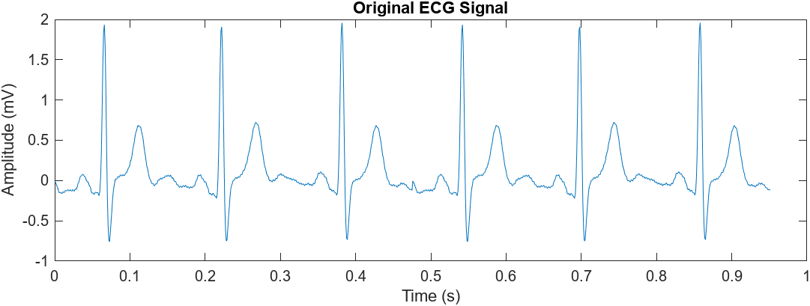
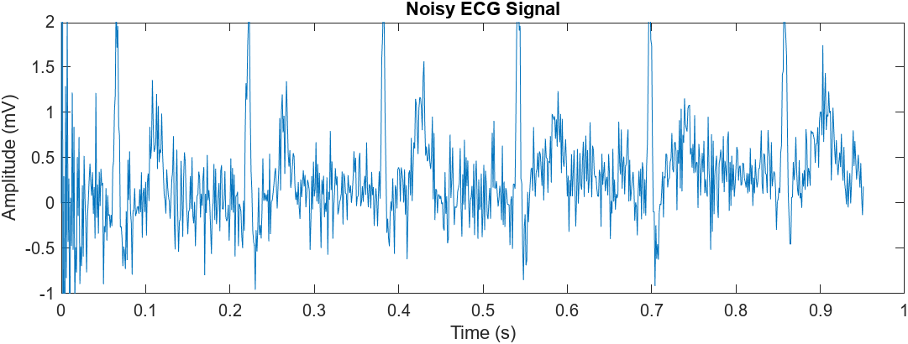
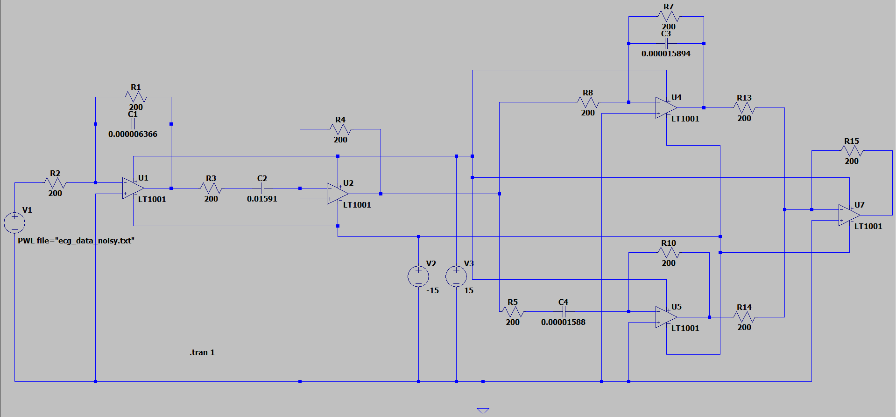
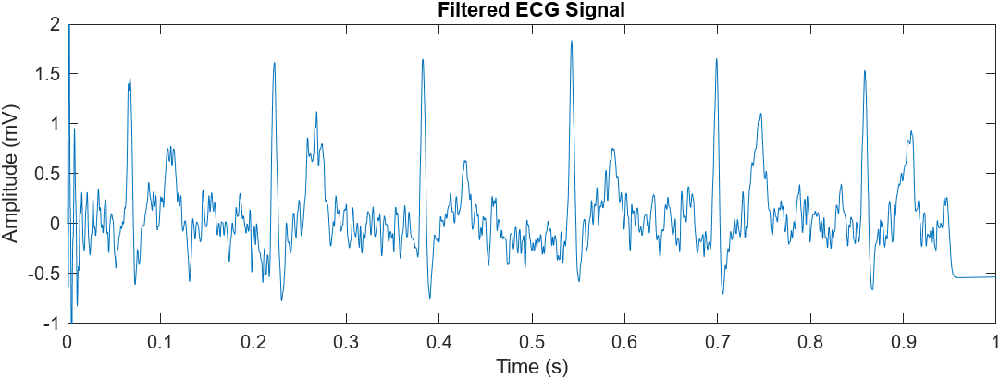

## Electrocardiography Signal Processing Project With MATLAB & LTSpice
   The **ecg_data.dat** file is an actual data file representing an ECG signal
   

   It was requested to add three different noise to the orijinal ECG signal
   - **Random noise at 50 Hz**
   - **Random low frequency noise below 0.05 Hz**
   - **Random high frequency noise above 150 Hz**

   The **ecg_data_noisy.txt** file is a data file representing the noisy ECG signal
   

   The **filter.asc** file is simulation file including a filter circuit
   

   The **filter.txt** file is a data file representing the filtered ECG signal
   